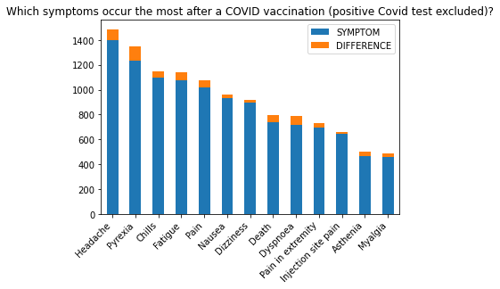

# Analysis of Symptoms possibly associated with Covid-19 Vaccinations

 
    
     
    <em>Source: iStock.com/style-photography</em>
 

In this project, I analyzed data from the "Vaccine Adverse Event Reporting System" (VAERS) which contains information about adverse reactions possibly associated with the vaccinations against Covid-19.

## Overview of the Results

 
    
 

 

* only a very small subset of the persons who got a vaccination against Covid-19 reported symptoms that might be associated with the vaccination
* most persons in the dataset experienced lighter symptoms
* for hospitalized people the frequent symptoms do not differ very much from the overall frequent symptoms while persons who died experienced very severe symptoms
* persons who died were elderly and had more often a medical background compared to the complete dataset
* with a machine learning algorithm, it is possible to predict whether a person might have to be hospitalized with a certain accuracy which means that our data has a certain power in terms of information content

For more detailed information got to my blog post which can be found here as well as on Medium ([Link](https://medium.com/@jannine.schreiber/tired-of-fake-news-how-to-do-your-own-data-analysis-4fa7259f2f03)). 

The most important visualizations can be found in my webapp: ([Link to WebApp](https://covid-vax-webapp.herokuapp.com/)).

## How can you use it?

### Technical Requirements

* Python 3.6
* Pandas
* scikit-learn
* matplotlib
* seaborn

### Files

The important files are: 
* **vaers_project_021921.ipynb**: 
analysis of symptoms reported as possibly associated adverse events after Covid-19 vaccination
* **blog_post.md**: _Tired of Fake News?  How To Do Your Own Data Analysis_ - a critical evaluation of the results from analysis
* **data**: the data I used can be found under data/data_021921/ 

## Credits and Acknowledgments

Must give credit to the Food andd Drug Administration (FDA) and Centers for Disease Control and Prevention (CDC) for providing the dataset and their helpful data use guide. You can find the data and descriptive information [here](https://vaers.hhs.gov/data/datasets.html?). This work was inspired by an analysis from 
Sumit Bhardwaj (see [here](https://www.kaggle.com/nvkex0/covid-19-vaccine-s-adverse-reactions)).  
Feel free to use the code here as you would like!

