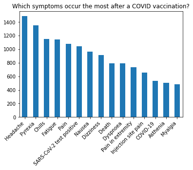
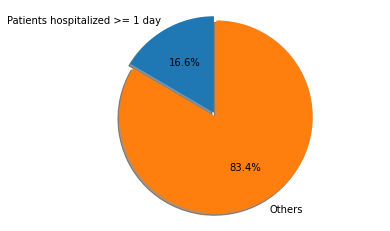
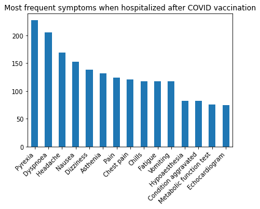
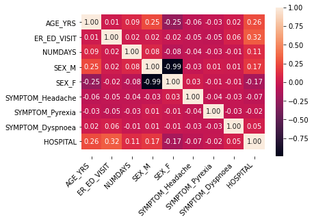
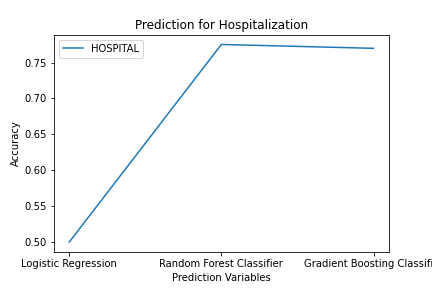

# Tired of Fake News?  How To Do Your Own Data Analysis 

 
    
     
    <em>Source: iStock.com/style-photography</em>
 

It is 2021, we are in the middle of a pandemic. We have waited for them for months, and now they are here: the vaccines against Covid-19. But besides the hope for the end of this pandemic, they brought doubts and worries: "Do they really work?", "I've heard that some people died from it.", "How bad are the side effects?"

So what else can we do other than carefully evaluating all the news articles, explanations from virologists and other experts or reading studies on that matter? We can look at real data and get a feeling for it. And this ist what I will show you here with a dataset that contains possible side effects of the Covid-19 vaccinations.

This is not a tutorial on how to analyze data with Python (although you can look at my code at the end of this article). Instead, I will focus on how to critically look at the data and what we can or cannot interpret based on it.

## About the Dataset 

For this analysis, I used data from the "Vaccine Adverse Event Reporting System" (VAERS) from 2021 (which contains VAERS reports processed as of 2/19/2021)[1]. VAERS is a system in the US where healthcare providers but also private individuals can report symptoms that might be (but of course don't have to be) associated with a vaccination. In total, there are **9100** entries of persons who reported experiencing one or several adverse events after a Covid-19 vaccination dose. To put that roughly into perspective: As of 03/01/2021, **76.9 million** Covid-19 vaccination doses have been administered in the US [2] since the start in December 2020, so our dataset is a small subset of the whole "population" of vaccinated people. This is important to keep in mind when drawing conclusions out of the data.

### General Overview

To get a brief overview, we can look at some general information about the persons who reported possible side effects.

 

 
    
 

On average, the vaccinated people in this dataset are 53 years old. 68 % of the patients are female, 28.4% are male and for 3.6 % the sex is unknown. 55.4 % of the vaccines are from Pfizer/Biontech while 45.5 % are Moderna vaccines. 

As a next step, we can explore the dataset by asking questions about the data.

**Here are some questions I am interested in:**
1. What are the most common side effects (symptoms) reported and when do they occur?
2. Severe symptoms - How many patients had to be hospitalized or died?
3. What is the (medical) background of the patients who died?
4. Can we predict the hospitalization of a patient based on the data?

## Question 1: What are the most common side effects (symptoms) reported and when do they occur?

### What we expect

We expect a high frequency of lighter symptoms like fatigue, headache, chills or pain like reported in the safety and efficacy studies from Biontech [3] and Moderna [4].

 
    
 

### What we see

Let's start with describing what we see. The majority of the most frequent symptoms are lighter symptoms like headache, fatigue, chills. However, being tested positive for Covid-19 and death can be found among the most frequent potential symptoms. The symptoms occur on average after 3 days.

### What it means

So what does that mean, does the vaccination lead to an Covid infection or even death? - Short answer: no. 

When we look at the frequencies, we have to keep in mind that
* it's a very small data set compared to the population of vaccinated persons
* we don't know the real cause of these symptoms
* the dataset is likely to be biased because not all persons who experienced light symptoms might have rated them as adverse reactions 
* we don't have an unvaccinated control group here to compare the symptoms to

So there is a lot that we don't know. But what do we know?  
Based on our previous knowledge, we know that neither a positive Covid-19 test nor death were common "side effects" for the Covid-19 vaccination [1, 2]. Moreover, the mRNA-based vaccines don't consist of the entire genome of the SARS-CoV-2 virus but only the spike protein. Hence, the vaccines technically cannot cause a positive Covid-19 test. [5] What is possible is that the persons were already infected before the vaccination or got infected afterwards (since the vaccination doesn't provide immediate full protection).  

Generally, when you collect data within an experimental study, you think about confounding variables that could influence the results beforehand and exclude or control them (e.g. with a control group). The data from VAERS is not prepared in that way, so we have to watch out not to jump to conclusions and look at the possible confounding variables provided in our dataset.   
This might be important when we look at the frequent appearance of "death" as symptom.

With these insights from our first plot, we know that the dataset includes patients infected with Covid-19. For them, we cannot keep apart symptoms that may be caused by the vaccination or the infection, so they need to be excluded from the dataset.   

This is the resulting overview of the most common symptoms for all patients that haven't been tested positive for Covid-19:

 
    
 

Only slight changes can be observed, so the data from persons tested positive for Covid-19 seem not to have influenced the overall tendencies for the frequency of the symptoms. 

While so far the overview shows mainly lighter symptoms, there are patients who have been hospitalized or died. An interesting next step would be to see whether the symptoms these patients show differ from the overall symptoms.

 ## Question 2: Severe symptoms - How many patients had to be hospitalized or died?

 ### What we expect

 For both hospitalized and deceased patients we expect a high frequency of more severe symptoms.

 

### What we see

From all vaccinated persons in the dataset, 14.7 % (1334 patients) were hospitalized and 9.6 % (873 patients) died after the Covid-19 vaccination. While for the hospitalized patients, the symptoms are quite similar to the overall common symptoms, the patients who died experienced severe symptoms like unresponsiveness to stimuli, cardiac arrest or resuscitation. 

### What it means

Based on the symptoms recorded, there is no clear difference between the frequent symptoms in the overview plot [(Question 1)](#Question-1:-What-are-the-most-common-side-effects-(symptoms)-reported-and-when-do-they-occur?) and the symptoms of hospitalized patients. Pyrexia and dyspnoea can be reasons for hospitalization but these symptoms apply only to a part of the patients. There still might be a pattern, we just cannot see it when looking at the most frequent symptoms.

While the plots from [Question 1](#Question-1:-What-are-the-most-common-side-effects-(symptoms)-reported-and-when-do-they-occur?) showed that death is a frequent symptom, a closer look at the death rate helps us understand that in fact only 9.6 % of the patients who reported symptoms died after the vaccination. Compared to the other frequent symptoms, these patients experience more severe symptoms.   

As explained above, with the current approach, we have not taken other influences into account that could be associated with the death of the patients. Fortunately, the dataset provides some additional information about the patients that we can analyze as well.

## Question 3: What is the (medical) background of the patients who died?

### What we expect

We expect a higher average age of the patients and possibly current illnesses or at least a history of illness for a majority of the patients.   

 

### What we see

The patients who died were 77 years old on average. 72.5 % (633) of these patients had a history of illness or were currently ill. To be more precise,  69.1 % (603 patients) had a history of illness while 41.8 % (365 patients) were ill at the time of vaccination.

### What it means

When we compare the age distribution and average age of all patients in the dataset with the patients who died, the average is higher for patients who died (difference: 24 years) and the distribution is sparser than the one that includes all patients. This indicates that mainly elderly people died.  
Looking at the history of illness and current illness, the percentage of patients who died is higher for both groups. The majority of persons who died had known previous illnesses while the percentage of people with a current illness who died is twice as much as for all patients.  
So all of these properties could have had an influence on the death of the patients.  

There would be a lot of possibilities to go more into detail on that matter. 
But now, I would like to show you how to take a look at the data from a different angle. 

## Question 4: Can we predict the hospitalization of a patient based on the data?

While with the analysis we did so far we can only look at one or a few factors at a time, machine learning algorithms can take multiple factors into account at the same time. Often times, you have defined a use case before analyzing data (e.g. a prediction task). What could that be for this data?  
A possible use case would be to predict whether a patient might have to be hospitalized possibly associated with the vaccination based on the patients' symptoms and other information. This could theoretically help hospitals to prepare for a potential need of higher capacity, of course only if the symptoms occur prior to an admission to the hospital.  
Additionally, the performance of a trained machine learning algorithm could help us getting an impression whether the information in the dataset provides enough information for such an algorithm to learn a pattern with a certain accuracy. 

### What we expect

For both target variables, we expect a prediction accuracy of > 50 % (50 % or less would mean the prediction is random) but  not necessarily > 90 % because some information might not be provided by the dataset. 

### The Method

For a prediction task, we generally use some variables from our dataset as input (preferably numerical) and one target variable as output that we can compare with the prediction of our algorithm. 

Here is a list of the variables used for the models:

| Variable Name      | Description |
| ----------- | ----------- |
| VAERS_ID      | Patient ID       |
| AGE_YRS   | Age of the patient  |
| SEX | Gender of the patient  |
| ER_ED_VISIT | whether the patient visited an Emergency Room |
| NUMDAYS | number of days the patient spent in hospital  |
| VAX_MANU | manufacturer of the vaccine |
  

**Target Variables**

| Variable Name | Description |
| ---------- | -------------- |
| HOSPITAL | whether the patient was in hospital |

To get a first impression, let's calculate the correlations between some of the factors for the model that might be interesting:

 
    
 

 There is a slight correlation of age, ER visit and sex with hospital while the few symptoms I chose show no notable correlations. 

#### Model Training
  
I trained the data with 3 different classifiers: Logistic Regression, Random Forest and Gradient Boosting.
As metric, I used a balanced test accuracy (because the classes are imbalanced). In the plot below, the balanced test accuracy is shown for all target variables and algorithms.

 
    
 

### What we see

The prediction accuracy for hospitalization reaches 50 % with a Logistic Regression, 75 % with the Random Forest Classifier and 77 % with the Gradient Boosting Classifier. 

### What it means

Apparently, the algorithm could find some kind of pattern within our data. When we compare the different classifiers, we see that the Logistic Regression classifier couldn't learn from the data while both other algorithms did. 
We shouldn't over-interpret these results right now since only 15 % of our data contains persons who were hospitalized. However, this will change once we have more data in the VAERS as is to be expected.  
When we look back on the results for symptoms for hospitalized patients [(Question 2)](#Question-2:-Severe-symptoms---How-many-patients-had-to-be-hospitalized-or-died?), there wasn't a clear difference to the overall most frequent symptoms. 77 % accuracy is a result you would have to improve for a real use case but what it shows us is that the dataset does provide some valuable information to learn from although we might not see everything directly. 

## Summary and Conclusion

In this article, we saw how we can escape the fake news and take a look at data ourselves. 

In particular, we found out about the data  

0. that only a very small subset of the persons who got a vaccination against Covid-19 reported symptoms that might be associated with the vaccination [(About the Dataset)](#About-the-Dataset )
1. that most persons in the dataset experienced lighter symptoms [(Q 1)](#Question-1:-What-are-the-most-common-side-effects-(symptoms)-reported-and-when-do-they-occur?)
2. that for hospitalized people the frequent symptoms do not differ very much from the overall frequent symptoms while persons who died experienced very severe symptoms [(Q 2)](#Question-2:-Severe-symptoms---How-many-patients-had-to-be-hospitalized-or-died?)
3. that persons who died were elderly and had more often a medical background compared to the complete dataset [(Q 3)](#Question-3:-What-is-the-(medical)-background-of-the-patients-who-died?)
4. that with a machine learning algorithm, it is possible to predict whether a person might have to be hospitalized with a certain accuracy which means that our data has a certain power in terms of information content [(Q 4)](#Question-4:-Can-we-predict-the-hospitalization-of-a-patient-based-on-the-data?)

In general, it's difficult to draw conclusions from the dataset because the sample size is small and we certainly don't know all confounding variables. While in controlled studies, persons who died would be examined to determine the cause of death, we can only analyze the variables we have. It is a good signal though that apparently the prediction models can find patterns in the data.   

You might have noticed that I used the structure of a scientific report as guidance to answer the questions. I find this quite helpful to make sure that you stay as neutral and careful with interpretations as possible.
Of course, these few questions and methods are just a start in exploring the dataset, there is a lot more left to find and to look into. However, the purpose of this analysis was just to get a feeling for the data, what questions we might want to ask and how to interpret the results critically. 

Of course, you will not always find data for the topics with controversial discussions. But here is the good thing: The more experience you gain in analyzing data, the more you will learn what to look for when you are reading articles and papers on the subject you're interested in: You will start looking for the sample size of the data and think about confounding variables that might have an influence on the result and identify when a subjective opinion leads to fast conclusions.
And this is what we need everyday!  
**So the question is: What will you analyze next?**

If you'd like to take a look at my code, feel free to visit my Github page: https://github.com/jannine92/covid19_vax_analysis

## Sources:

[1] VAERS Data Sets. https://vaers.hhs.gov/data/datasets.html (retrieved: 03/04/2021)  
[2] Centers for Disease Control and Prevention. COVID-19 Vaccinations in the United States. https://Covid.cdc.gov/Covid-data-tracker/#vaccinations (retrieved: 03/02/2021)  
[3] Polack, F. P., Thomas, S. J., Kitchin, N., Absalon, J., Gurtman, A., Lockhart, S., ... & Gruber, W. C. (2020). Safety and efficacy of the BNT162b2 mRNA Covid-19 vaccine. New England Journal of Medicine, 383(27), 2603-2615.  
[4] Baden, L. R., El Sahly, H. M., Essink, B., Kotloff, K., Frey, S., Novak, R., ... & Zaks, T. (2021). Efficacy and safety of the mRNA-1273 SARS-CoV-2 vaccine. New England Journal of Medicine, 384(5), 403-416.  
[5] Matthew Binnicker, Coronavirus Frontlines (Contributor Group) (2021, Februar 26). Could Vaccination Cause Me To Test Positive For Covid-19? https://www.forbes.com/sites/coronavirusfrontlines/2021/02/26/could-vaccination-cause-me-to-test-positive-for-covid-19/?sh=6ee7d8bb38b3 (retrieved: 03/02/2021)

